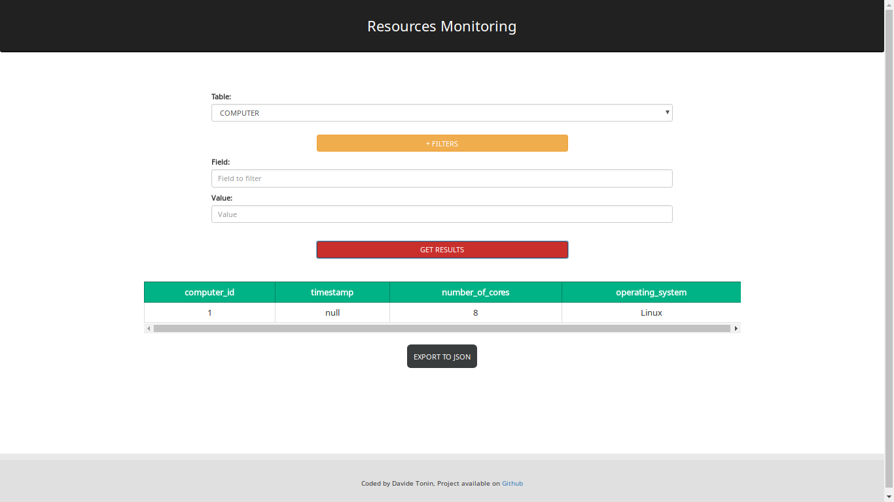

# Resources Monitoring

### Web application to view information stored in database table with custom filtering on-the-fly
- Written in HTML5, CSS, Javascript/JQuery and PHP.
- The list of tables is based on the database selected in the configuration file.
- You can filter the data that you want.
- You can download the selected data into a json format file.

### Requirements
- Web Server (ex. Apache)
- PHP (tested on both 5.x and 7.x)
- Database (ex. MySQL)
- You can also connect to a remote database changing the 'DB_HOST' variable in the configuration file.

#### Test View

